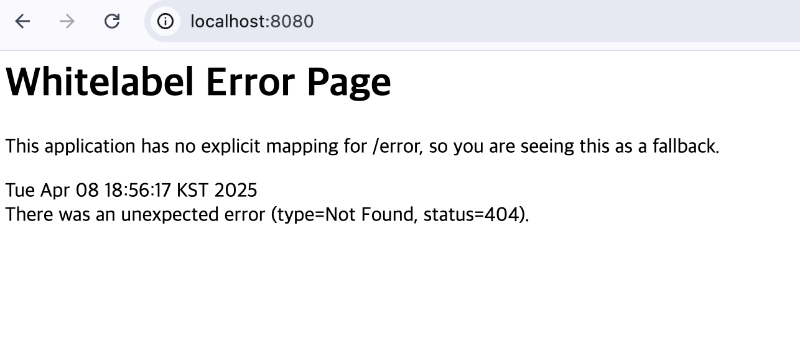

# week 1

## client와 server
- client: server에게 data의 생성/조회/수정/삭제 요청을 전송
- server: 요청대로 동작을 수행 후 응답을 전송
* 이 때, 사용하는 규칙: protocol
* ex) http: web에서의 protocol
  
## protocol
- http를 통해 요청 보낼 때, http method, url이 필요힘
- http method: 데이터를 다루는 방법 (동사 역할)
- url: 다룰 데이터의 위치 (목적어 역할)
- 자주 사용하는 http method
- -  1. GET: 조회
- -  2. POST: 생성 - 같은 내용 계속 생성 가능
- -  3. PUT: 수정 - 없다면 생성, 있다면 새 것으로 교체
- -  4. PATCH: 수정 - 기존과 비교하여 달라진 점을 추가로 수정
- -  5. DELETE: 삭제

* url의 구조
  - 프로토콜(scheme) + 서버 주소(domain) + 서버 내 데이터 위치 (path)
  - ex) http://www.example.com/user/{user_id}/nickname
  * Query String
   - path 뒤에 ? + key=value 쌍들
   - ex) .com/post/search?page=1&keyword=hello
  
* http
  - http header: 통신에 대한 정보
  - - 언제, 누가 보냈는가, http method종류, url
  - http body: 주고 받으려는 data (필수로 적을 필요는 없음)
  - - json 형식
 
 * * status code 
  - 응답을 보낼 땐 요청에 대한 처리 결과를 나타내는 상태코드 포함
  - 응답 data의 http header에 포함!!
  - 200 : 처리 성공 (ok)
  - 201 : data 생성 성공 (created)
  - 400 : client 요청 오류 (bad request)
  - 404 : 서버에 요청 데이터 없음 (not found)
  - 500 : 서버 내부 에러 (internal server error)
  
* frontend vs backend
  - browser에서 응답받은 화면에서 날씨, 증시 등은 매일 내용이 바뀜
  - 자주 변하지 않는 화면 UI와 자주 변하는 contents를 분리하자는 생각
  - -> frontend , backend의 분리
  - front: 화면에 채울 컨텐츠 데이터를 백엔드에게 요청
  - back: db에서 가져온 컨텐츠 데이터를 프론트에게 응답

## API란?
- 프론트와 백엔드 모두 웹에서 동작하는 어플리케이션 -> http로 data 주고받음
- http는 단순한 규칙 -> 구체적인 규칙은 그 안에서 직접 정의
- 'API' = Application Programming Interace
- : 어플리케이션과 소ㅇ하는 창구를 정의
- ex) 청소기의 회로를 전부 알 필요 없어 버튼을 누르면 작동 가능하다는 점
### backend API
  - front가 back에 요청 보낼 때, "어떤 http method, url"을 사용해야 하는지 정의한 것
  - 각 요청에 대해 어떤 응답을 보내는지 정의한 것
* RESTAPI
  - REST architecture를 따르도록 설계한 API
  - url: 조작할 데이터(명사) + http method: 데이터에 대한 행위(동사)

## todo mate 필요한 API명세

1. 인증 관련

- 회원가입: POST /signup
- 로그인: POST /login

2. 할 일 & 달력 관련
   
- 특정 날짜의 할 일 조회: GET /todo?date={yyyy-mm-dd}
- 전체 할 일 조회: GET /todo/list
- 할 일 생성: POST /todo
- 할 일 수정: PATCH /todo/{todo_id}
- 할 일 삭제: DELETE /todo/{todo_id}
- 할 일 체크: POST /todo/{todo_id}/check
- 할 일 체크 해제: POST / todo{todo_id}/uncheck
  
1. 친구 관련

- 닉네임으로 친구 검색: GET /friend/search?nickname={nickname}
- 친구 팔로우: POST /friend/{user_id}/follow
- 친구 언팔로우: DELETE /friend/{user_id}/unfollow
- 친구 신고: POST /friend/{user_id}/report
- 친구 신고 취소: DELETE /friend/{user_id}/report

## 프로젝트 사진 첨부

